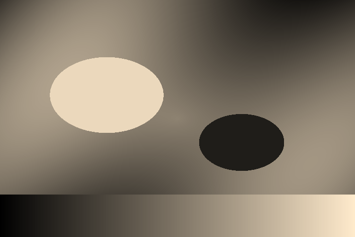

# 1bit.world

Convert images into a **1-bit, dithered aesthetic** — warm cream + near-black,
classic-Mac / Playdate / _Return of the Obra Dinn_ vibes — right in your browser.

**100% client-side.** Your images never leave your device: there's no server, no
upload, no storage. That also makes it free to run and trivial to deploy.



## Features

- **Dithering algorithms** — Atkinson, Floyd–Steinberg, Burkes, Sierra Lite
  (error diffusion), Ordered 4×4 / 8×8 (Bayer), and plain threshold.
- **Two-tone palettes** — Parchment (default), Mono, Blueprint, Amber CRT,
  Game Boy, Noir.
- **Live controls** — pixel size, threshold, contrast, brightness, invert.
- **Off-thread processing** — pixel work runs in a Web Worker, so the UI stays
  smooth even on large images.
- **Export** — download PNG, copy to clipboard, or native share (mobile).
- **Drop · browse · paste** — load an image however you like.

## Stack

| Layer       | Choice                                             |
| ----------- | -------------------------------------------------- |
| Framework   | Next.js 15 (App Router) · React 19 · TypeScript    |
| Styling     | Tailwind CSS v4                                     |
| State       | Zustand                                             |
| Processing  | HTML Canvas / `ImageData` in a Web Worker          |
| Export      | `canvas.toBlob`, Clipboard API, Web Share API      |
| Deploy      | Vercel (static — no serverless functions needed)   |

## How it works

Per image, the pipeline is:

```
decode → downsample (pixel size) → grayscale (Rec.709) + contrast/brightness
       → dither to 1-bit → map to 2-colour palette → upscale (nearest-neighbour)
```

The core kernel ([`lib/dither/process.ts`](lib/dither/process.ts)) is a pure,
DOM-free function over `ImageData`, so the same code runs in the Web Worker
([`lib/workers/dither.worker.ts`](lib/workers/dither.worker.ts)) and as a
main-thread fallback. The client engine
([`lib/image/engine.ts`](lib/image/engine.ts)) handles decode, sampling and
painting.

## Develop

```bash
npm install
npm run dev      # http://localhost:3000
npm run build    # production build (what Vercel runs)
```

Regenerate the sample test image:

```bash
node scripts/make-sample.mjs
```

## Deploy

Push to GitHub and import the repo in Vercel. No environment variables, no
storage, no functions — it builds to static assets. The default Next.js preset
works out of the box.

## Roadmap

- [ ] **Video** — convert short clips via WebCodecs (with an ffmpeg.wasm
      fallback); export GIF / WebM. The dithering engine is already shared and
      frame-ready.
- [ ] Before/after compare slider, grain/noise, custom 2-colour picker.
